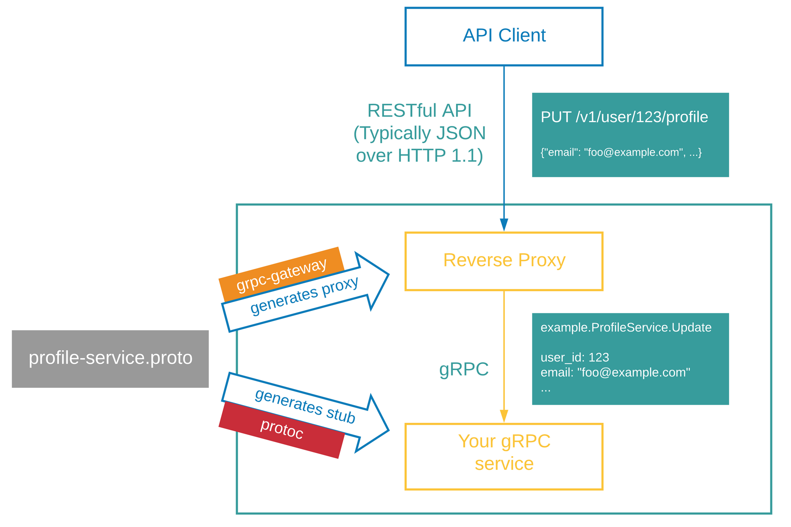

## http request forwarding rpc example

gRPC-Gateway is a plugin for the Google protocol buffer compiler protoc. It reads the protobuf service definition and generates a reverse proxy server that translates the RESTful HTTP API into gRPC. this server is generated based on the google.api.http annotation in your service definition.

 

### Using

(1) Start the service `go run main.go`

(2) Access swagger UI `http://127.0.0.1:8080/swagger-ui/` in your browser, then input `http://127.0.0.1:8080/swagger/account.swagger.json` to test the grpc interface proxied by http.
