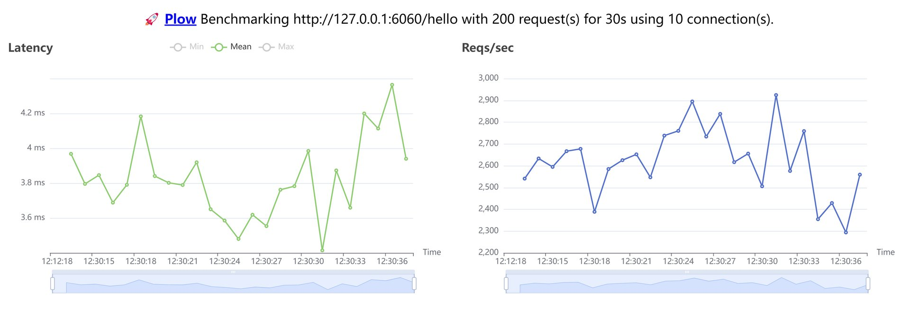
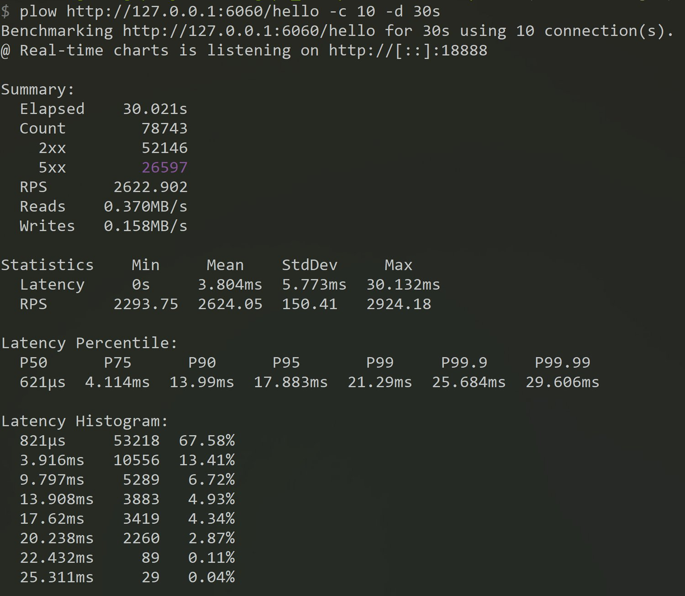

## hystrix metrics example

### Using

Install the pressure testing tool

> go install github.com/six-ddc/plow@latest

Running grpc server and client

```bash
cd server && go run main.go
cd client && go run main.go
```

Crush test for 30 seconds

> plow http://127.0.0.1:6060/hello -c 10 -d 30s

<br>

### Press test results

During the squeeze test, open `http://localhost:18888/` in your browser to see the qps and latency graphs, as shown below.



<br>

Use the `plow` tool to crunch the results, as shown in the following image.



<br>

Open `http://localhost:6060/metrics` in your browser to see gin, hystrix, go metrics

```bash
# HELP gin_requests_duration 
# TYPE gin_requests_duration summary
gin_requests_duration_sum{code="200",handler="main.CircuitBreakerWrapper",host="127.0.0.1:6060",method="GET",node="zys-pc",url="/hello"} 15448.420899999936
gin_requests_duration_count{code="200",handler="main.CircuitBreakerWrapper",host="127.0.0.1:6060",method="GET",node="zys-pc",url="/hello"} 52146
gin_requests_duration_sum{code="503",handler="main.CircuitBreakerWrapper",host="127.0.0.1:6060",method="GET",node="zys-pc",url="/hello"} 260075.4174000013
gin_requests_duration_count{code="503",handler="main.CircuitBreakerWrapper",host="127.0.0.1:6060",method="GET",node="zys-pc",url="/hello"} 26579

# HELP hystrix_circuit_breaker_attempts circuit open
# TYPE hystrix_circuit_breaker_attempts counter
hystrix_circuit_breaker_attempts{name="demo_breaker_/hello"} 78743
# HELP hystrix_circuit_breaker_concurrency_in_use circuit open
# TYPE hystrix_circuit_breaker_concurrency_in_use gauge
hystrix_circuit_breaker_concurrency_in_use{name="demo_breaker_/hello"} 4640
# HELP hystrix_circuit_breaker_context_deadline_exceeded circuit open
# TYPE hystrix_circuit_breaker_context_deadline_exceeded counter
hystrix_circuit_breaker_context_deadline_exceeded{name="demo_breaker_/hello"} 0
# HELP hystrix_circuit_breaker_errors circuit open
# TYPE hystrix_circuit_breaker_errors counter
hystrix_circuit_breaker_errors{name="demo_breaker_/hello"} 26597
# HELP hystrix_circuit_breaker_failures circuit open
# TYPE hystrix_circuit_breaker_failures counter
hystrix_circuit_breaker_failures{name="demo_breaker_/hello"} 26597
# HELP hystrix_circuit_breaker_fallback_failures circuit open
# TYPE hystrix_circuit_breaker_fallback_failures counter
hystrix_circuit_breaker_fallback_failures{name="demo_breaker_/hello"} 0
# HELP hystrix_circuit_breaker_fallback_successes circuit open
# TYPE hystrix_circuit_breaker_fallback_successes counter
hystrix_circuit_breaker_fallback_successes{name="demo_breaker_/hello"} 26597
# HELP hystrix_circuit_breaker_rejects circuit open
# TYPE hystrix_circuit_breaker_rejects counter
hystrix_circuit_breaker_rejects{name="demo_breaker_/hello"} 0
# HELP hystrix_circuit_breaker_run_duration circuit open
# TYPE hystrix_circuit_breaker_run_duration gauge
hystrix_circuit_breaker_run_duration{name="demo_breaker_/hello"} 46612
# HELP hystrix_circuit_breaker_short_circuits circuit open
# TYPE hystrix_circuit_breaker_short_circuits counter
hystrix_circuit_breaker_short_circuits{name="demo_breaker_/hello"} 0
# HELP hystrix_circuit_breaker_successes circuit open
# TYPE hystrix_circuit_breaker_successes counter
hystrix_circuit_breaker_successes{name="demo_breaker_/hello"} 52146
# HELP hystrix_circuit_breaker_timeouts circuit open
# TYPE hystrix_circuit_breaker_timeouts counter
hystrix_circuit_breaker_timeouts{name="demo_breaker_/hello"} 0
# HELP hystrix_circuit_breaker_total_duration circuit open
# TYPE hystrix_circuit_breaker_total_duration gauge
hystrix_circuit_breaker_total_duration{name="demo_breaker_/hello"} 5.3626849e+07
```

From the results of the metrics collection, a total of 78,743 requests were made, 51,146 requests were successful and 26,597 requests were incorrect, which exceeded 1,000 requests in 10s and had an error rate above 25%, triggering the fuse mechanism.
