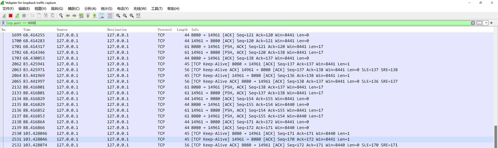

## Example of a GRPC keepalive parameter change
   
Change the default 15 seconds ping to 20 seconds ping
   
After running for a while, stop the server and the client shows the connection changed from ` READY` to `IDEL` status.
   
Check the network packets in `wireshark`, as shown below.

