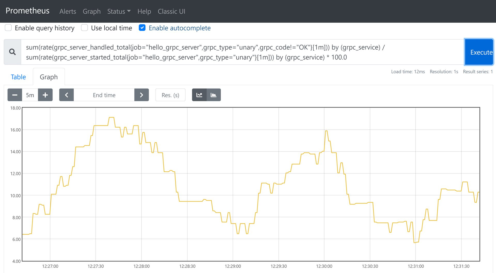

## Example of a GRPC customized metrics


### Start up grpc server and client

Start rpc server and client, metrics service port `8282` for rpc server, metrics service port `8283` for rpc client.

Open `http://localhost:8283/metrics` in your browser and the grpc server metrics and go metrics data are as follows.

```bash
# HELP go_gc_duration_seconds A summary of the pause duration of garbage collection cycles.
# TYPE go_gc_duration_seconds summary
go_gc_duration_seconds{quantile="0.75"} 0.0005493
go_gc_duration_seconds{quantile="1"} 0.0005493
# HELP grpc_server_handled_total Total number of RPCs completed on the server, regardless of success or failure.
# TYPE grpc_server_handled_total counter
grpc_server_handled_total{grpc_code="NotFound",grpc_method="SayHello",grpc_service="proto.Greeter",grpc_type="unary"} 0
grpc_server_handled_total{grpc_code="OK",grpc_method="SayHello",grpc_service="proto.Greeter",grpc_type="unary"} 38
grpc_server_handled_total{grpc_code="OutOfRange",grpc_method="SayHello",grpc_service="proto.Greeter",grpc_type="unary"} 0
# HELP grpc_server_handling_seconds Histogram of response latency (seconds) of gRPC that had been application-level handled by the server.
# TYPE grpc_server_handling_seconds histogram
grpc_server_handling_seconds_bucket{grpc_method="SayHello",grpc_service="proto.Greeter",grpc_type="unary",le="+Inf"} 39
grpc_server_handling_seconds_sum{grpc_method="SayHello",grpc_service="proto.Greeter",grpc_type="unary"} 0.7947776
grpc_server_handling_seconds_count{grpc_method="SayHello",grpc_service="proto.Greeter",grpc_type="unary"} 39
# HELP grpc_server_msg_received_total Total number of RPC stream messages received on the server.
# TYPE grpc_server_msg_received_total counter
grpc_server_msg_received_total{grpc_method="SayHello",grpc_service="proto.Greeter",grpc_type="unary"} 39
# HELP grpc_server_msg_sent_total Total number of gRPC stream messages sent by the server.
# TYPE grpc_server_msg_sent_total counter
grpc_server_msg_sent_total{grpc_method="SayHello",grpc_service="proto.Greeter",grpc_type="unary"} 38
# HELP grpc_server_started_total Total number of RPCs started on the server.
# TYPE grpc_server_started_total counter
grpc_server_started_total{grpc_method="SayHello",grpc_service="proto.Greeter",grpc_type="unary"} 39
```

<br>

Open `http://localhost:8283/metrics` in your browser and the grpc client metrics and go metrics are as follows

```bash
# HELP grpc_client_handled_total Total number of RPCs completed by the client, regardless of success or failure.
# TYPE grpc_client_handled_total counter
grpc_client_handled_total{grpc_code="DeadlineExceeded",grpc_method="SayHello",grpc_service="proto.Greeter",grpc_type="unary"} 2
grpc_client_handled_total{grpc_code="OK",grpc_method="SayHello",grpc_service="proto.Greeter",grpc_type="unary"} 41
# HELP grpc_client_msg_received_total Total number of RPC stream messages received by the client.
# TYPE grpc_client_msg_received_total counter
grpc_client_msg_received_total{grpc_method="SayHello",grpc_service="proto.Greeter",grpc_type="unary"} 2
# HELP grpc_client_msg_sent_total Total number of gRPC stream messages sent by the client.
# TYPE grpc_client_msg_sent_total counter
grpc_client_msg_sent_total{grpc_method="SayHello",grpc_service="proto.Greeter",grpc_type="unary"} 43
# HELP grpc_client_started_total Total number of RPCs started on the client.
# TYPE grpc_client_started_total counter
grpc_client_started_total{grpc_method="SayHello",grpc_service="proto.Greeter",grpc_type="unary"} 43
# HELP process_cpu_seconds_total Total user and system CPU time spent in seconds.
# TYPE process_cpu_seconds_total counter
process_cpu_seconds_total 0.015625
# HELP promhttp_metric_handler_requests_total Total number of scrapes by HTTP status code.
# TYPE promhttp_metric_handler_requests_total counter
promhttp_metric_handler_requests_total{code="200"} 12
promhttp_metric_handler_requests_total{code="500"} 0
promhttp_metric_handler_requests_total{code="503"} 0
```

<br> 

### Add the configuration to prometheus

```yaml
  - job_name: 'hello_grpc_server'
    scrape_interval: 2s
    static_configs:
      - targets: ['localhost:8282']
        labels:
          project: 'demo'
          env: 'dev'

  - job_name: 'hello_grpc_client'
    scrape_interval: 2s
    static_configs:
      - targets: ['localhost:8283']
        labels:
          project: 'demo'
          env: 'dev'
``` 

Request the prometheus api `curl -X POST http://localhost:9090/-/reload` to make the configuration take effect.

<br>

### Useful query examples

```bash
# request inbound rate
sum(rate(grpc_server_started_total{job="hello_grpc_server"}[1m])) by (grpc_service)

# unary request error rate
sum(rate(grpc_server_handled_total{job="hello_grpc_server",grpc_type="unary",grpc_code!="OK"}[1m])) by (grpc_service)

# unary request error percentage
sum(rate(grpc_server_handled_total{job="hello_grpc_server",grpc_type="unary",grpc_code!="OK"}[1m])) by (grpc_service) / sum(rate(grpc_server_started_total{job="hello_grpc_server",grpc_type="unary"}[1m])) by (grpc_service) * 100.0

# average response stream size
sum(rate(grpc_server_msg_sent_total{job="hello_grpc_server",grpc_type="server_stream"}[10m])) by (grpc_service) / sum(rate(grpc_server_started_total{job="hello_grpc_server",grpc_type="server_stream"}[10m])) by (grpc_service)

# 99%-tile latency of unary requests
histogram_quantile(0.99, sum(rate(grpc_server_handling_seconds_bucket{job="hello_grpc_server",grpc_type="unary"}[5m])) by (grpc_service,le))

# percentage of slow unary queries (>250ms)
100.0 - (sum(rate(grpc_server_handling_seconds_bucket{job="hello_grpc_server",grpc_type="unary",le="0.25"}[5m])) by (grpc_service) / sum(rate(grpc_server_handling_seconds_count{job="hello_grpc_server",grpc_type="unary"}[5m])) by (grpc_service)) * 100.0
```

<br>

Simulated request error percentage view



