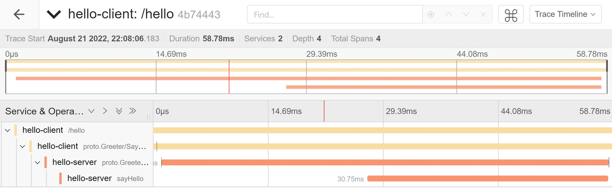

## Example of a tracing for a gin call to rpc

(1) Start jaeger service

```bash
docker run -d --name jaeger \
  -e COLLECTOR_ZIPKIN_HOST_PORT=:9411 \
  -p 5775:5775/udp \
  -p 6831:6831/udp \
  -p 6832:6832/udp \
  -p 5778:5778 \
  -p 16686:16686 \
  -p 14250:14250 \
  -p 14268:14268 \
  -p 14269:14269 \
  -p 9411:9411 \
  jaegertracing/all-in-one:latest
```

Uploading information to jaeger via `6831` udp port.

<br>

(2) Set the variables `jaegerAgentHost` and `jaegerAgentPort` in the code file `tracingConfig.go`.

(3) Start the grpc server.

(4) Start the http server.

(5) Invoke the api interface.

> curl -X POST http://127.0.0.1:6060/hello

(6) View link trace information.

Open jaeger's UI in your browser `http://127.0.0.1:16686`

Select **[service]** in the left menu bar and click on **[file trace]** to view the details, as shown below.


