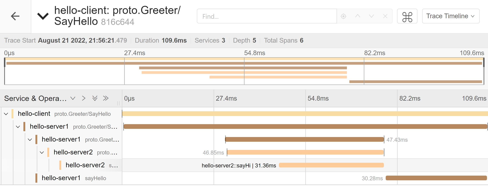

## Example of tracing for rpc calls to rpc

(1) Start jaeger service

```bash
docker run -d --name jaeger \
  -e COLLECTOR_ZIPKIN_HOST_PORT=:9411 \
  -p 5775:5775/udp \
  -p 6831:6831/udp \
  -p 6832:6832/udp \
  -p 5778:5778 \
  -p 16686:16686 \
  -p 14250:14250 \
  -p 14268:14268 \
  -p 14269:14269 \
  -p 9411:9411 \
  jaegertracing/all-in-one:1.33
```

Uploading information to jaeger via `6831` udp port.

<br>

(2) Start the server2 rpc service

(3) Start server1 rpc service

(4) Run client

(5) View link trace information

Open jaeger's UI in your browser `http://127.0.0.1:16686`

Select **[service]** in the left menu bar and click on **[file trace]** to view the details, as shown below.




<br>

 OpenTracing Semantic Conventions https://github.com/opentracing/specification/blob/master/semantic_conventions.md